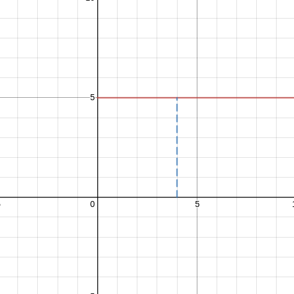
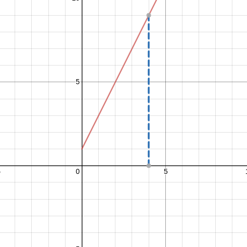
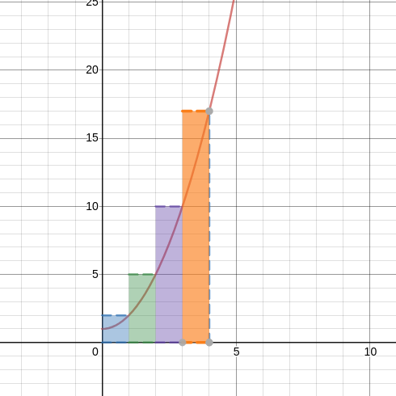
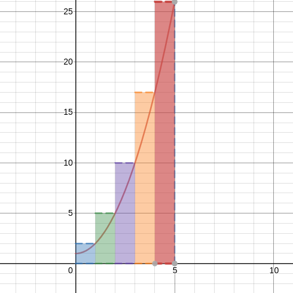
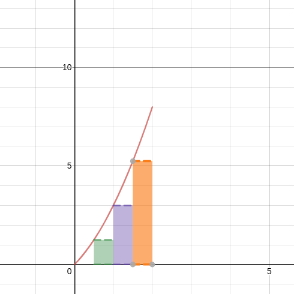
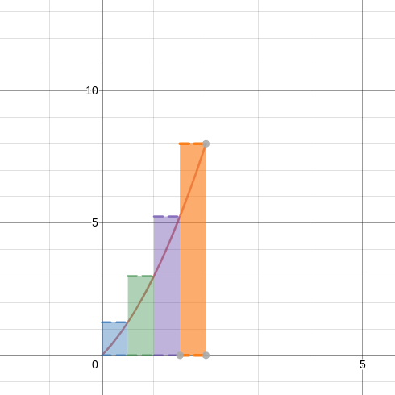

Ch 6.1 # 1 - 6

1. A particle starts at x = 0 and moves along the x-axis with velocity v(t) = 5 for time t >= 0. Where is the particle at t = 4?

5 * 4 = 20
The particle is at 20 units when t = 4

2. A particle starts at x = 0 and moves along the x-axis with velocity v(t) = 2t + 1 for time t >= 0. Where is the particle at t = 4?

((1 + 9) / 2) * 4 = 20
The particle is at 20 units when t = 4

3. A particle starts at x = 0 and moves along the x-axis with velocity v(t) = t^2 + 1 for time t >= 0. Where is the particle at t = 4? Approximate the area under the curve by using four rectangles of equal width and heights determined by the right-endpoints of the intervals.

A = 2 + 5 + 10 + 17
A = 34

4. A particle starts at x = 0 and moves along the x-axis with velocity v(t) = t^2 + 1 for time t >= 0. Where is the particle at t = 5? Approximate the area under the curve by using five rectangles of equal width and heights determined by the right-endpoints of the intervals.

A = 2 + 5 + 10 + 17 + 26
A = 60

y = 2x - x^2 { x | 0 <= x <= 2 }

5. 
a. Sketch the region R

b. Partition [0, 2] into 4 subintervals and show the four rectangles that LRAM uses to approximate the area of R. Computer the LRAM sum without a calculator.

LRAM = 0 + 1.25 + 3 + 5.25
LRAM = 9.5

6. Repeat exercise 5b for RRAM
(see fig 6.1.6)

RRAM = 1.25 + 3 + 5.25 + 8
RRAM = 17.8
