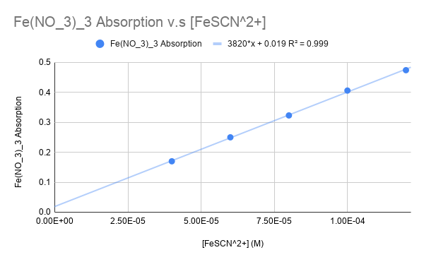
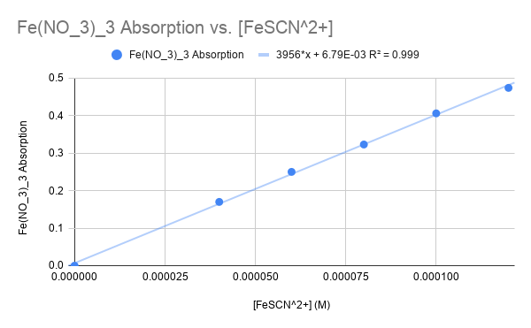

# FeSCN Calibration Plots

## Data

| Solution |  KSCN  | Water absorbance | Fe(NO_3)_3 Absorbance |   [FeSCN^2+]  |
|:--------:|:------:|:----------------:|:---------------------:|:-------------:|
|     1    | 2.0 mL |       0.200      |         0.170         | 4.0 x 10^-5 M |
|     2    | 3.0 mL |       0.285      |         0.250         | 6.0 x 10^-5 M |
|     3    | 4.0 mL |       0.362      |         0.323         | 8.0 x 10^-5 M |
|     4    | 5.0 mL |       0.438      |         0.406         | 1.0 x 10^-4 M |
|     5    | 6.0 mL |       0.507      |         0.474         | 1.2 x 10^-4 M |

## Plots

Fe(NO_3)_3 absorption as a function of concentration without zero point:

Fe(NO_3)_3 absorption as a function of concentration with zero point:

