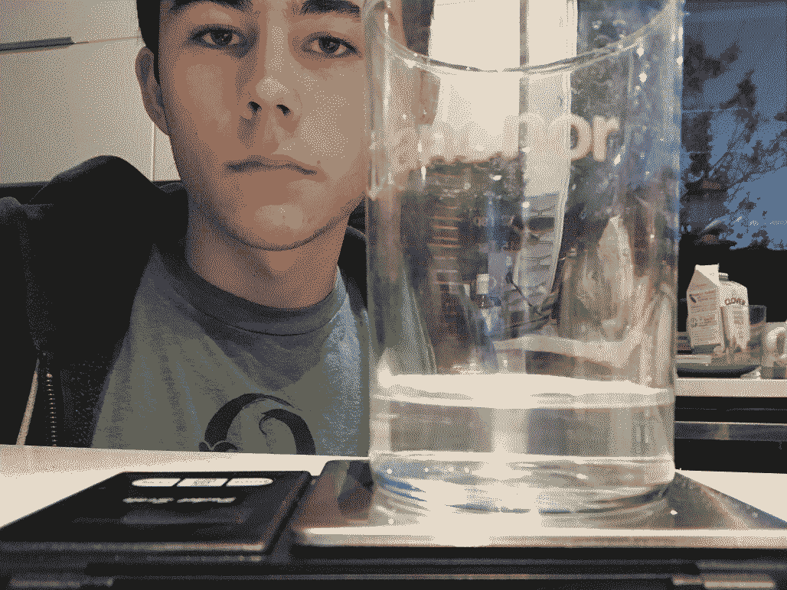

# Solubility lab

## Procedure

Into a beaker of known weight was added an amount of salt, and the beaker was then weighed. The mass of the salt was 4.0 grams. Water was then gradually poured into the beaker until it covered the salt, whereupon the solution was stirred until the salt stopped dissolving. Water was then added repeatedly, in decreasing volume, to the beaker, stirring in between, until the salt just barely dissolved in the water. The final mass of water required to dissolve the salt was found to be 18.4 grams. 

## Photo

## Data

Salt: 4.0 g  
Water: 18.4 mL  

salt molar mass = 22.99 g/mol + 35.45 g/mol  
salt molar mass = 58.44 g/mol  

n = 4.0 g / 58.44 g/mol  
n = 0.06845 mol  

conc. = 0.06845 mol / 0.0184 L  
conc. = 3.720 M  

k = [p]^c_p / [r]^c_r  
k = (3.720 M) * (3.720 M)  
k = 14  
