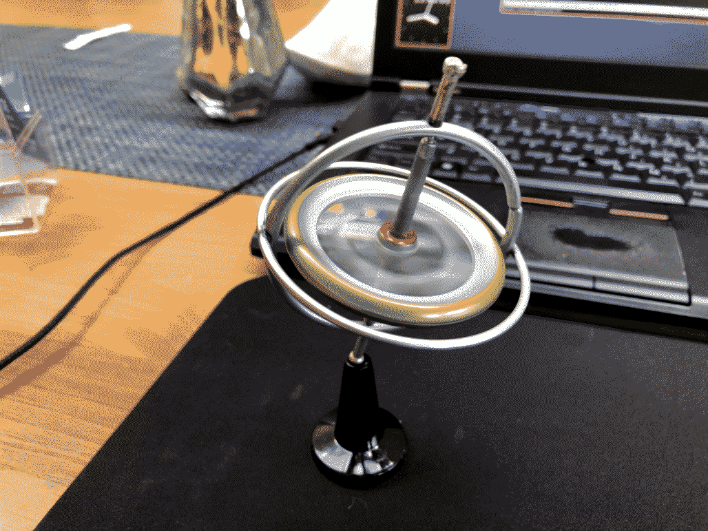
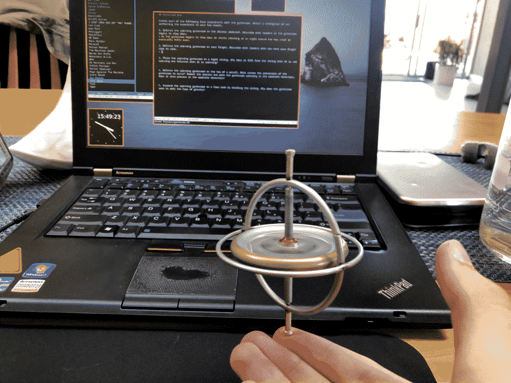
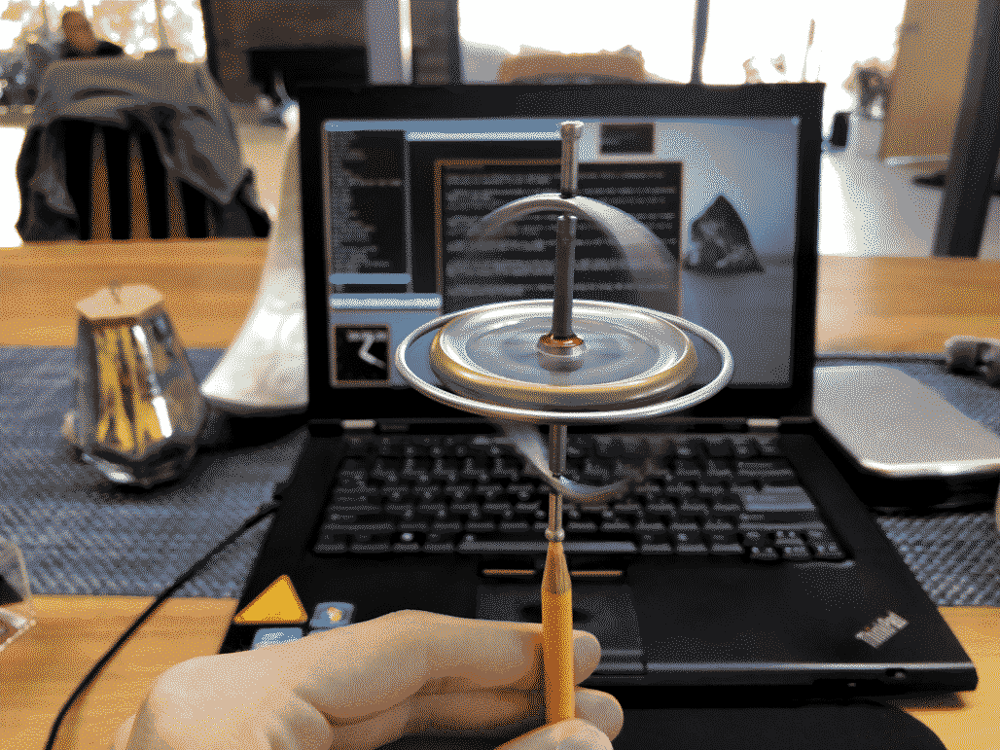
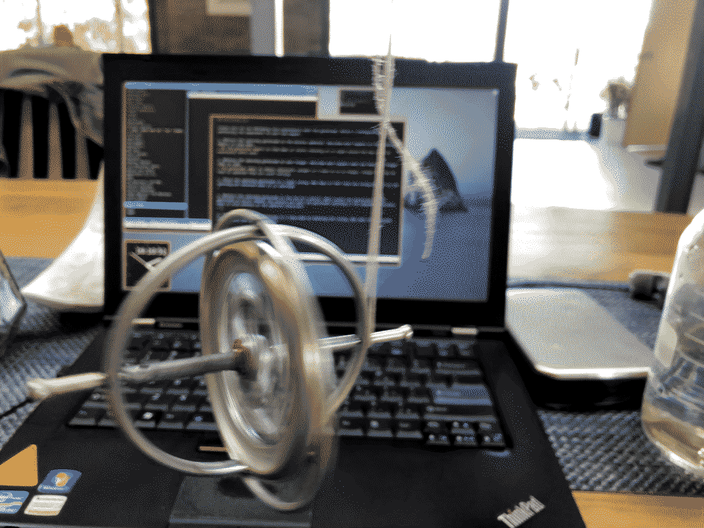

## Gyroscope Lab

Create each of the following five experiments with the gyroscope. Attach a photograph of you performing the experiment to your lab report.

1. **Balance the spinning gyroscope on the plastic pedestal. Describe what happens as the gyroscope  begins to slow down.**
As the gyroscope begins to slow down it starts rotating at an angle around the top until it eventually falls over.

2. **Balance the spinning gyroscope on your finger. Describe what happens when you move your finger side to side.**
The gyroscope seems to remain relatively upright as I move it on my finger, though that may be hard to separate from its usual tilting.

3. **Place the spinning gyroscope on a tight string. Why does it fall from the string when it is not spinning but balances when it is spinning?**
I swear this is a Sisyphean task. I can assume that the gyroscopic stabilization from the spinning weight allows the gyroscope to balance, but I was unable to manage this, let alone photograph it. I spent half an hour on this.

4. **Balance the spinning gyroscope on the tip of a pencil. What causes the precession of the gyroscope to occur? Repeat the process but with the gyroscope spinning in the opposite direction, does it also precess in the opposite direction?**
The gyroscope always begins to rotate in the direction it is spinning, and by reversing the initial direction of rotation, the rotation of the overall gyroscope can also be reversed.

5. **Suspend the spinning gyroscope in a loop made by doubling the string. Why does the gyroscope seem to defy the laws of gravity?**
The gyroscope can stay parallel to the ground (for a short time), because the force exerted by its rotation pushes it up, slowing down its spinning.

